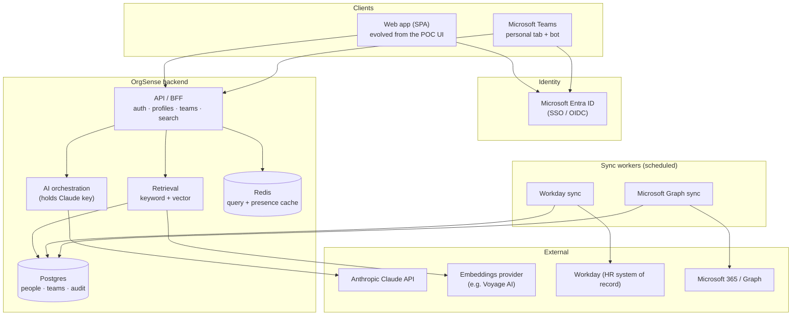
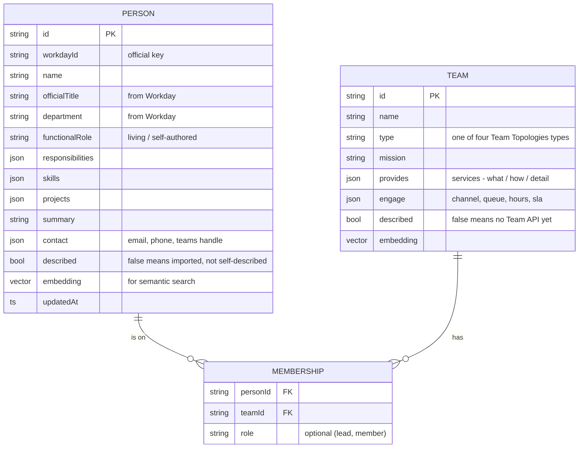
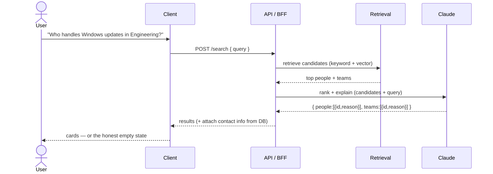
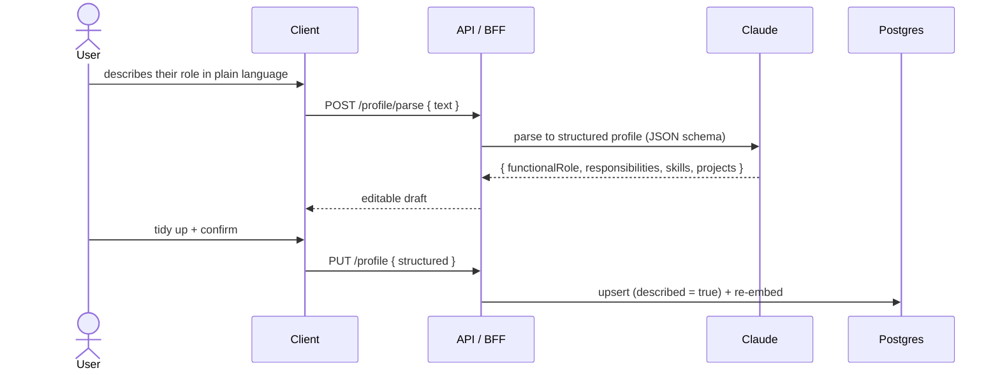
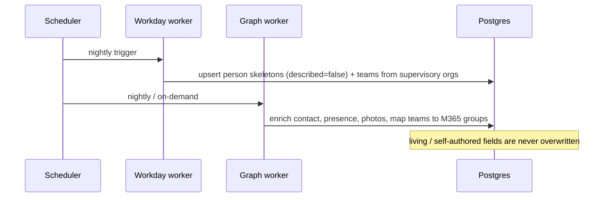

# Proposed system architecture

**Status: proposed / forward-looking design.** The current repo is a static,
browser-only **proof of concept** (see [README](README.md)) — no backend, no
database, data in `localStorage`, and an *optional* bring-your-own-key call to
Claude from the browser. This document describes what a **production** version
would look like: a real backend with a shared datastore, server-side AI, and
sync from Workday and Microsoft 365. It is meant to give leadership and
engineering a concrete target and to show that the POC is deliberately shaped to
grow into it.

Companion docs:
- **[INTEGRATIONS.md](INTEGRATIONS.md)** — how to plumb in Workday + Microsoft Teams.
- **[AI-PLAYBOOK.md](AI-PLAYBOOK.md)** — the prompts, schemas, and model config for every AI task.

---

## Design principles

1. **Two layers of truth.** *Official* data (who exists, titles, reporting lines,
   contact info) is synced from systems of record (Workday, Microsoft 365). The
   *living* layer (what a person actually does, each team's Team API) is authored
   by people. The system never lets a sync overwrite the living layer.
2. **Honest by construction.** If no one has described a capability, the system
   says so. The AI is instructed to return nothing rather than guess (see
   [AI-PLAYBOOK.md](AI-PLAYBOOK.md)).
3. **AI runs server-side.** The Anthropic API key lives on the backend, never in
   the browser. (The POC's browser-side key toggle exists only because a static
   site has no server.)
4. **Privacy-first.** Staff directory only; respect Workday privacy flags; never
   surface home/PII contact info; role-based access to edit.
5. **Incremental.** Each phase is shippable on its own (see [Phased roadmap](#phased-roadmap)).

---

## High-level architecture

### Components

| Component | Responsibility |
| --- | --- |
| **Web app (SPA)** | The OrgSense chat UI, evolved from the POC. Talks only to the backend API. |
| **Microsoft Teams app** | A **personal tab** embedding the SPA (SSO via Entra ID) and a **bot** for conversational capture with Adaptive Cards, so people can update/query from inside Teams. |
| **Entra ID** | Single sign-on. The signed-in user *is* the persona — no separate login. Group membership gates who may edit what. |
| **API / BFF** | Backend-for-frontend: profile & team CRUD, the `/search` endpoint, authz, and rate limiting. The only thing clients talk to. |
| **AI orchestration** | Wraps every Claude call (parse, rank, extract). Holds the API key, applies the prompts/guardrails in [AI-PLAYBOOK.md](AI-PLAYBOOK.md), logs calls for eval. |
| **Retrieval** | Hybrid candidate selection: Postgres full-text/keyword **and** vector similarity (embeddings). Returns a small candidate set for Claude to rank. |
| **Postgres** | People, teams, memberships, embeddings, and an audit trail. System of record for the *living* layer. |
| **Redis** | Caches identical query results and Microsoft Teams presence lookups. |
| **Workday sync worker** | Nightly: pull the roster + supervisory orgs → upsert person *skeletons* (`described = false`) and seed team records. |
| **Graph sync worker** | Enrich contact info, presence, photos; map functional teams to Microsoft 365 groups + membership. |
| **Claude API** | Profile parsing, query ranking/answering, Team API extraction. See [AI-PLAYBOOK.md](AI-PLAYBOOK.md). |
| **Embeddings provider** | Vector embeddings for semantic search (Anthropic recommends **Voyage AI**). Optional for v1 (keyword-only works, as in the POC). |

---

## Data model

The POC schema in [`js/data.js`](js/data.js) already reflects the target model —
production just moves it into a real database.

Field-level mapping to Workday and Microsoft Graph sources is in
[INTEGRATIONS.md](INTEGRATIONS.md).

---

## Key flows

### 1. Query — "who does X / how do I do X"

Retrieval narrows thousands of records to a handful; Claude does the judgment
(which genuinely match, and why) and is instructed to return **nothing** when
nothing fits. The application attaches contact info after ranking, so the model
never handles or invents contact details.

### 2. Profile update — free text → structured profile

This is the POC's `parseSelfDescription` flow, promoted to a server call. Team
leads publish a Team API the same way.

### 3. Nightly sync — the official skeleton

---

## Cross-cutting concerns

- **AuthN / AuthZ.** Entra ID SSO. A person edits **only their own** profile; a
  team lead edits **only their team's** API. Enforce with Entra group membership
  and backend checks. Read access is org-wide (staff directory).
- **Privacy & compliance.** FERPA/PII: staff directory only, never student data;
  honor Workday "unlisted" flags; surface only work contact info. Have data
  owners review before any real sync. Log who changed what (audit table).
- **Prompt-injection safety.** Self-authored profile text is **untrusted input**.
  When it's later fed to the ranking model as candidate data, it is delimited and
  the model is told to treat it as data, not instructions — see
  [AI-PLAYBOOK.md](AI-PLAYBOOK.md) § Guardrails.
- **Caching & cost.** Redis caches identical queries and presence. On the Anthropic
  side, **prompt caching** on the stable system prompt cuts per-call cost. Backfill
  jobs (e.g. suggested roles for skeletons) use the **Batch API** (50% cheaper).
- **Observability.** Log every AI call (prompt version, model, tokens, latency,
  result) to power the eval harness and cost dashboards. Standard app tracing/metrics.
- **Scaling.** Retrieval + one Claude call per query is cheap and horizontal.
  Precompute embeddings on write, not read. Presence is the only "live" external
  call — cache it briefly.

---

## Technology options

Concrete, **swappable** recommendations — pick what fits the university's stack.

| Concern | Recommended | Alternatives |
| --- | --- | --- |
| Backend API | Node/TypeScript or Python | Any language with an Anthropic SDK |
| Datastore | Postgres (+ `pgvector`) | Managed cloud SQL; a dedicated vector DB |
| Cache | Redis | Managed equivalent |
| Hosting | The university's existing cloud (AWS/Azure) | Containers / serverless |
| Identity | Microsoft Entra ID (already in place for M365) | Existing campus SSO/SAML |
| LLM | Anthropic Claude (`claude-opus-4-8` default) | See model table in AI-PLAYBOOK.md |
| Embeddings | Voyage AI | Any embeddings model; or keyword-only for v1 |
| Teams app | Teams Toolkit / Microsoft 365 Agents SDK | Web app only (skip the Teams bot) |

---

## Deployment & environments

- **Environments:** dev → staging → prod, each with its own datastore and Entra
  app registration. Seed non-prod with the POC's fictional data.
- **CI/CD:** build/test on push; deploy on merge; run the AI eval suite (see
  [AI-PLAYBOOK.md](AI-PLAYBOOK.md) § Evaluation) as a gate.
- **Secrets:** Anthropic key, Workday ISU credentials, and the Entra client secret
  live in a secrets manager — never in the repo or the browser.
- **Sync scheduling:** the Workday/Graph workers run as scheduled jobs (nightly
  full or delta); presence is fetched on demand and cached.

---

## Phased roadmap

| Phase | Scope | Status |
| --- | --- | --- |
| **0 — POC** | Static demo: chat UI, local matcher, Team API v1, seed data | ✅ done (this repo) |
| **1 — Real backend** | API + Postgres + Entra SSO; Workday nightly sync creates skeletons; move AI server-side (parse + rank) | proposed |
| **2 — Teams + semantic search** | Graph enrichment; Teams tab/bot for capture; embeddings-based retrieval; team-lead Team API editing | proposed |
| **3 — Insight** | Team dependencies + value-stream view; coverage nudges; presence; analytics for leadership | proposed |

---

## How this maps to the current POC

The POC is intentionally seam-aligned so this drops in without a rewrite:

- **`OrgData`** (in [`js/data.js`](js/data.js)) wraps all reads/writes. Point it at
  the backend API instead of `localStorage` and the UI is unchanged.
- **`OrgEngine.search` / `searchTeams`** (in [`js/engine.js`](js/engine.js)) are the
  only search entry points. Replace their bodies with a call to `/search`.
- The **person/team schemas** already carry the official-source fields
  (`officialTitle`, `department`, `contact.workdayId`, …) and the `described`
  flag that models "imported but not self-described."
- The **optional real-AI toggle** already demonstrates the exact Claude request
  shape — production just moves the key server-side and swaps the prompts for the
  hardened ones in [AI-PLAYBOOK.md](AI-PLAYBOOK.md).

---

_This is a design reference generated with AI assistance; see
[AI-DISCLOSURE.md](AI-DISCLOSURE.md). Validate technology and vendor choices
against the university's standards before building._
